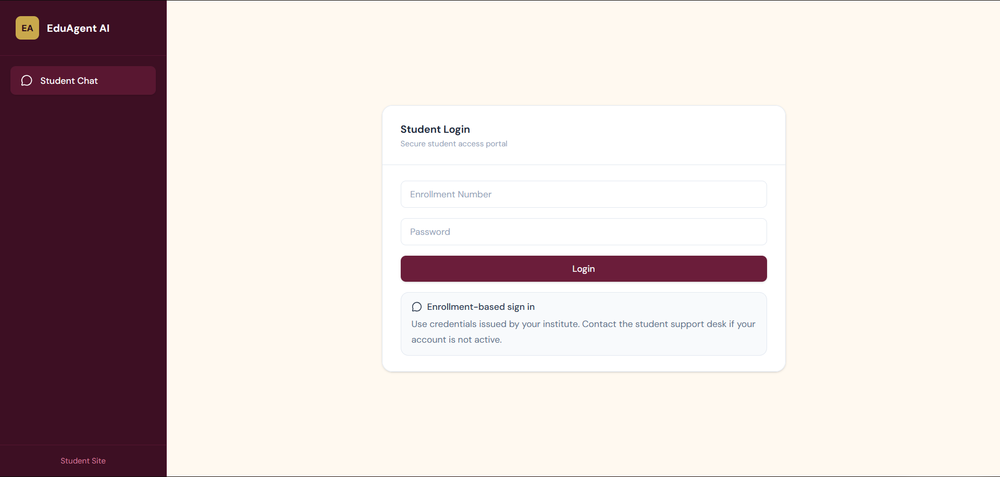
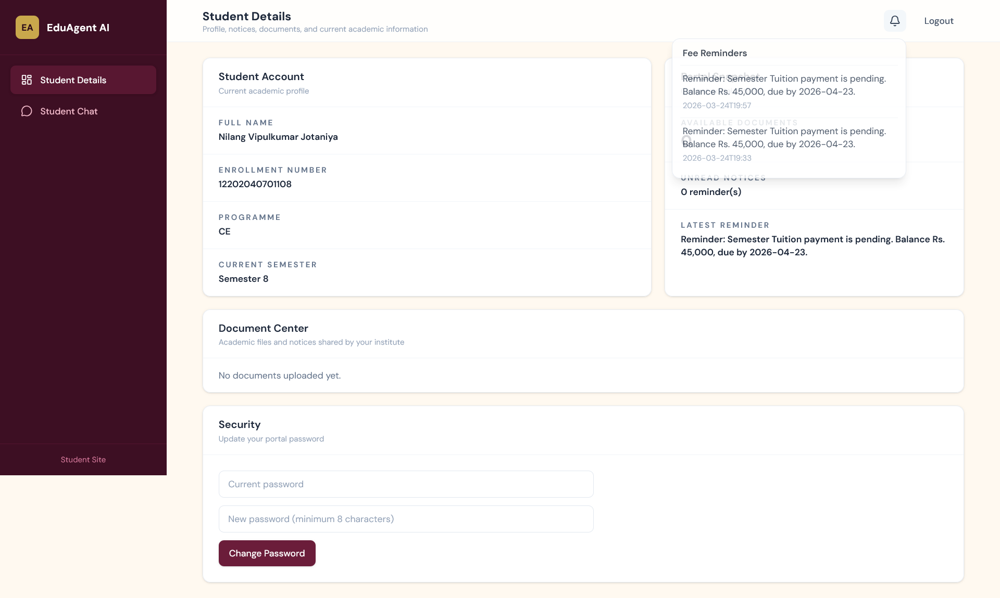
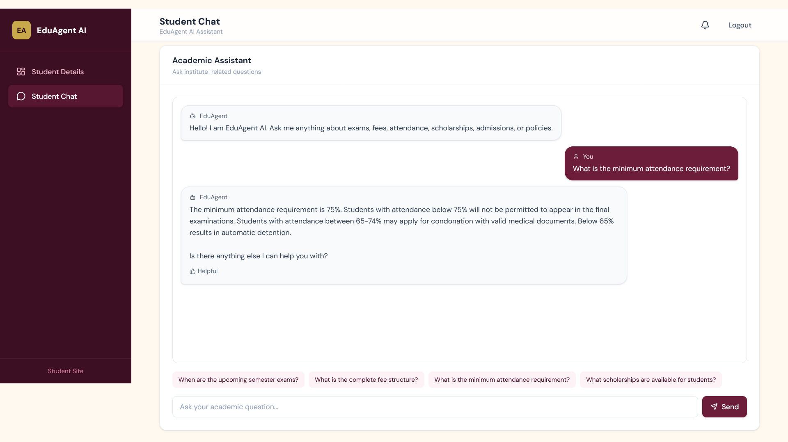
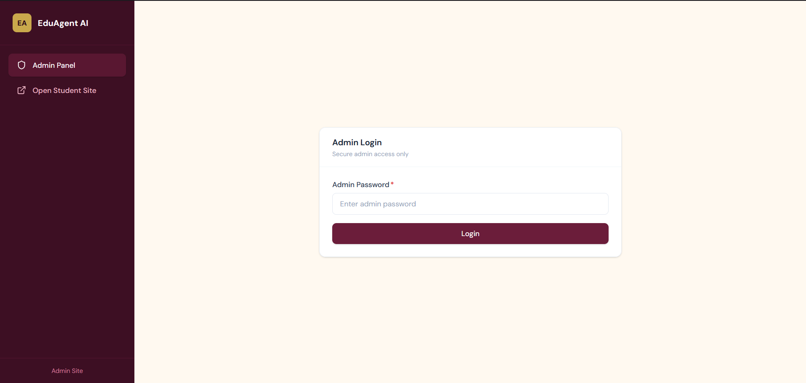
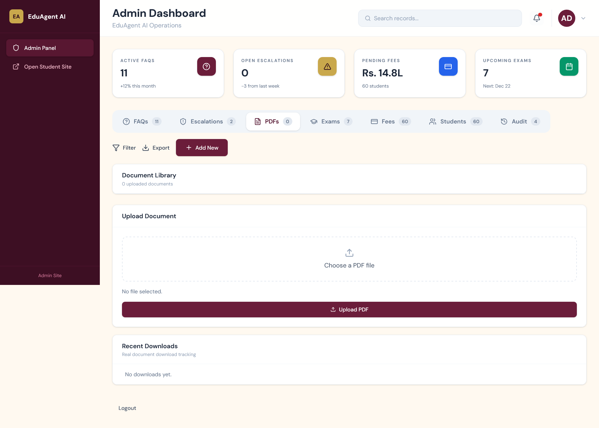
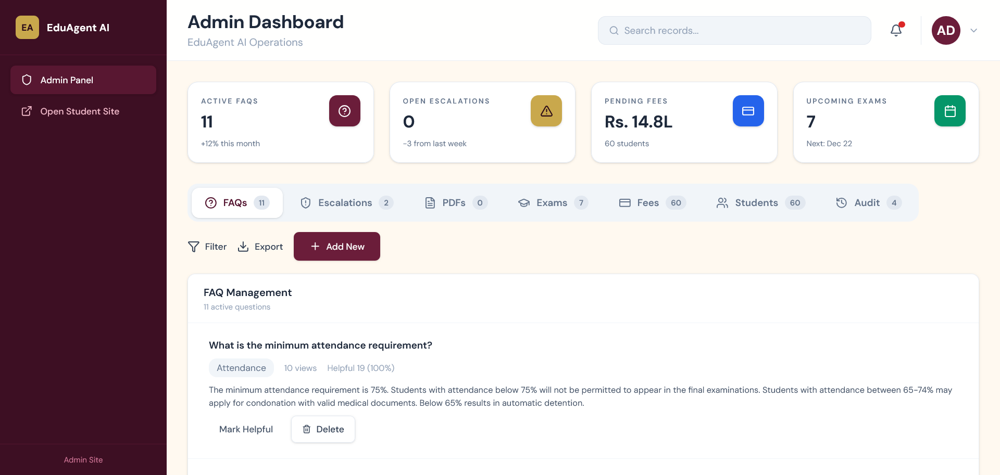
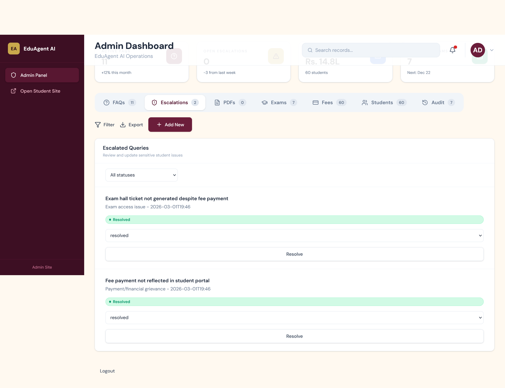
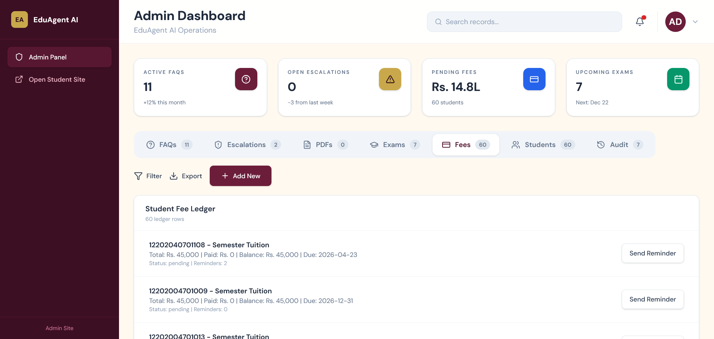

# 🎓 EduAgent AI — Multi-Agent Assistant for Academic Administration

<div align="center">


[](https://python.org)
[](https://fastapi.tiangolo.com)
[](https://react.dev)
[](https://mongodb.com/atlas)
[](https://ollama.com)
[](https://langchain.com)

**A GenAI-powered, multi-agent intelligent assistant that automates and simplifies academic administration tasks in colleges and universities.**

[Features](#-features) • [Architecture](#-system-architecture) • [Tech Stack](#-tech-stack) • [Getting Started](#-getting-started)

</div>

---

## 📌 Overview

**EduAgent AI** is a multi-agent academic helpdesk for student support and admin operations.

Instead of students manually visiting offices or searching across scattered documents, EduAgent AI provides a single interface for:

- exams
- fees
- attendance
- scholarships
- notices
- downloadable institutional documents

> 💡 Built around a **local AI workflow** using Ollama, with MongoDB-backed academic data and separate student/admin frontends.

---

## ✨ Features

### 🤖 Student Portal
- Enrollment-number based login
- Separate **Student Details** page and **Student Chat** page
- Document center with tracked downloads
- Reminder visibility for student fee follow-up
- FAQ feedback capture from student interactions
- Fast-path responses for common FAQ-style queries

### 🔧 Admin Portal
- Password-protected admin dashboard
- FAQ management
- Escalation review and status updates
- PDF upload and download tracking
- Exam management
- Student fee ledger management with reminders
- Student management with:
  - create
  - edit
  - delete
  - bulk import from sanitized `PDF / CSV / XLSX`

### 🧠 Multi-Agent Architecture
| Agent | Role |
|---|---|
| **Query Understanding Agent** | Classifies student questions into categories |
| **Information Retrieval Agent** | Fetches FAQs, schedules, fees, and document context |
| **Response Generation Agent** | Generates answers using phi3:mini via Ollama |
| **Escalation Agent** | Flags sensitive queries for admin review |

---

## 🏗️ System Architecture

```
Student Query
      │
      ▼
┌─────────────────────────────────────────────┐
│              EduAgent AI Pipeline           │
│                                             │
│  1. Escalation Agent  ──► Sensitive? ──► Admin Review
│         │ No                                │
│         ▼                                   │
│  2. Query Understanding Agent               │
│         │                                   │
│         ▼                                   │
│  3. Information Retrieval Agent             │
│         │  MongoDB + optional PDF context   │
│         ▼                                   │
│  4. Response Generation Agent               │
│         │  phi3:mini via Ollama             │
│         ▼                                   │
│      AI Response / Downloads / Feedback     │
└─────────────────────────────────────────────┘
```

---

## 🛠️ Tech Stack

| Layer | Technology | Purpose |
|---|---|---|
| **Student Frontend** | React + Vite | Student details and chat portal |
| **Admin Frontend** | React + Vite | Admin operations dashboard |
| **Backend API** | FastAPI | Student/admin APIs |
| **AI / LLM** | phi3:mini via Ollama | Local response generation |
| **Database** | MongoDB Atlas | FAQs, students, fees, reminders, escalations |
| **PDF Search** | FAISS + LangChain | Semantic search over uploaded PDFs |
| **PDF Processing** | PyPDF | Text extraction and processing |
| **Environment** | python-dotenv | Local environment configuration |

---

## 📁 Project Structure

```
EduAgent_AI/
│
├── backend_api.py                 ← FastAPI backend
├── start_llm.py                   ← Ollama/bootstrap helpers
├── app.py                         ← Legacy Streamlit entry
│
├── agents/
│   ├── query_agent.py
│   ├── retrieval_agent.py
│   ├── response_agent.py
│   └── escalation_agent.py
│
├── database/
│   ├── mongo_db.py
│   └── seed_mongodb.py
│
├── UI/                            ← Student frontend
├── UI-admin/                      ← Admin frontend
├── utils/
│   ├── pdf_processor.py
│   └── student_importer.py
│
├── uploaded_pdfs/                 ← Local uploaded files (gitignored)
├── vector_db/                     ← Local vector index (gitignored)
├── .env                           ← Local secrets (gitignored)
└── requirements.txt
```

---

## 🚀 Getting Started

### Prerequisites
- Python 3.12+
- Node 22.22.1 recommended
- [Ollama](https://ollama.com/download)
- MongoDB Atlas connection

### 1. Clone the Repository
```bash
git clone https://github.com/NilangJotaniya/EduAgent_AI.git
cd EduAgent_AI
```

### 2. Create & Activate Virtual Environment
```bash
python -m venv .venv

# Windows
.venv\Scripts\activate

# Mac/Linux
source .venv/bin/activate
```

### 3. Install Backend Dependencies
```bash
pip install -r requirements.txt
```

### 4. Install Frontend Dependencies
```bash
cd UI
npm install
cd ..

cd UI-admin
npm install
cd ..
```

### 5. Configure Environment Variables
Create a local `.env` file in the project root:

```env
MONGO_URI=your-mongodb-uri
MONGO_DB_NAME=eduagent_db
ADMIN_PASSWORD=your-admin-password
OLLAMA_BASE_URL=http://localhost:11434
OLLAMA_MODEL=phi3:mini
CORS_ORIGINS=http://localhost:5173,http://127.0.0.1:5173,http://localhost:5174,http://127.0.0.1:5174
ENABLE_DEMO_SEED=false
```

### 6. Start Ollama
```bash
ollama serve
```

### 7. Run the Backend
```bash
python -m uvicorn backend_api:app --reload --port 8000
```

### 8. Run the Student Frontend
```bash
cd UI
npm run dev
```

### 9. Run the Admin Frontend
```bash
cd UI-admin
npm run dev
```

---

## 🎯 Usage

### For Students
1. Sign in with enrollment number and password
2. View student details and reminders
3. Download shared documents from the document center
4. Open the separate chat page for academic questions

### For Admin Staff
1. Login to the admin portal
2. Manage FAQs, exams, PDFs, students, and fee ledger
3. Edit incorrect student entries directly without delete/recreate
4. Send reminders and review escalated queries

---

## Screenshots

### Student Portal

#### Student Login


#### Student Details


#### Student Chat


### Admin Portal

#### Admin Login


#### Admin Dashboard


#### AdminFAQS


#### Admin Escalations


#### AdminFeesManagement


## 📦 Notes

- Student and admin portals are separated
- Student details and student chat are on different routes
- Student passwords are stored hashed in MongoDB
- FAQ-type chat queries use a fast path for lower latency
- PDF/vector search only runs when the question likely needs document context
- This repository should contain only non-sensitive code and sanitized sample content

---

## 🔮 Future Enhancements

- [ ] first-login password reset flow
- [ ] production deployment configuration
- [ ] student query history
- [ ] better analytics for admin activity
- [ ] ERP/SIS integration

---

## 👨‍💻 Author

<div align="center">

### Nilang Jotaniya

[](https://github.com/NilangJotaniya)

</div>

---


